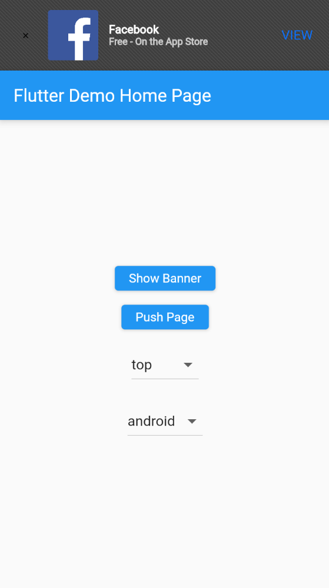
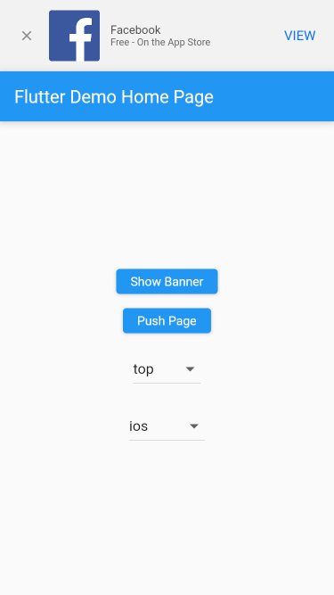

# Smart Banner

Display a smart banner on top of the screen of your Flutter Web application.

Inspired by [smart-app-banner](https://github.com/kudago/smart-app-banner/) and [react-smartbanner](https://github.com/patw0929/react-smartbanner)

## Screenshots




## Usage

Wrap your view with a `SmartBannerScaffold` widget, if you want a persistant banner on top of your app you might need to directly use it inside the `MaterialApp.builder` property.

```dart
class MyApp extends StatelessWidget {
  @override
  Widget build(BuildContext context) {
    return MaterialApp(
      builder: (context, child) {
        if (child != null) {
            return SmartBannerScaffold(
                properties: BannerProperties(
                    title: 'MyApp',
                    buttonLabel: 'VIEW',
                    icon: Image.asset('assets/icon.png'),
                    androidProperties: BannerPropertiesAndroid(
                        packageName: 'com.my.app',
                    ),
                    iosProperties: BannerPropertiesIOS(
                        appId: '123456789',
                    ),
                ),
                child: child,
            );
        }
      },
      home: MyHomePage(title: 'Flutter Demo Home Page'),
    );
  }
}
```